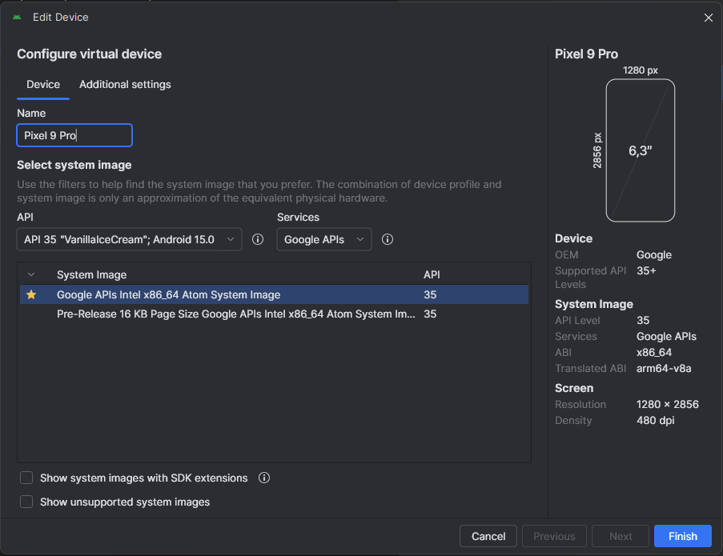
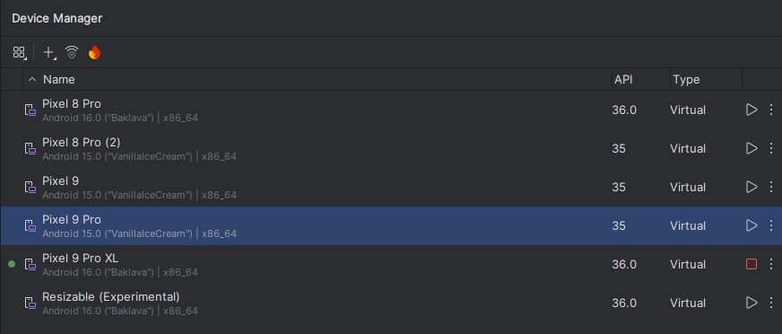
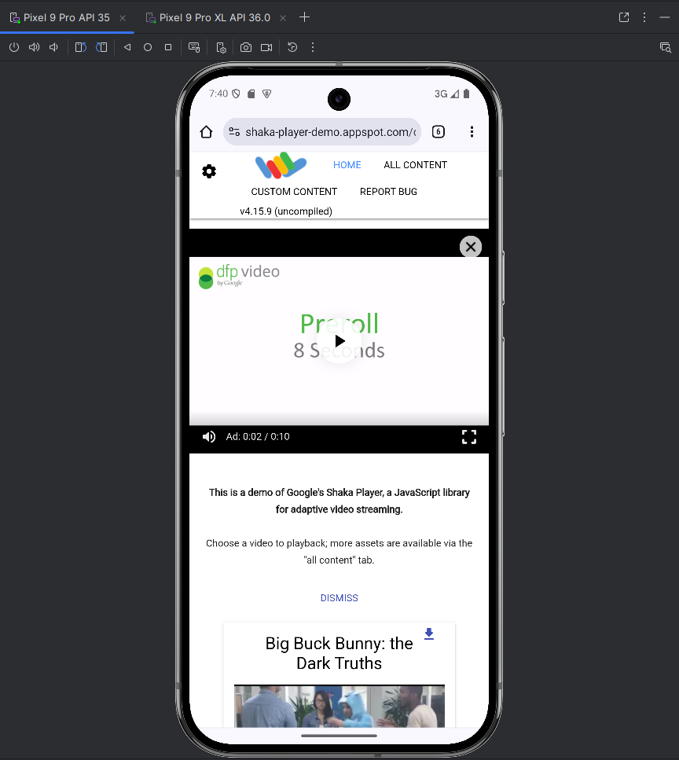

# Automatyczny Ekstraktor Kluczy Widevine L3 (Wersja z Ulepszoną Automatyzacją) / Automatic Widevine L3 Key Extractor (Enhanced Automation Version)

## Wersja Polska (PL)

Ten projekt zawiera skrypt w języku Python, który w sposób zautomatyzowany i powtarzalny przeprowadza proces ekstrakcji kluczy Widevine Content Decryption Module (CDM) z **urządzeń z systemem Android posiadających uprawnienia roota**.

Skrypt jest teraz zunifikowanym narzędziem, które potrafi zarówno współpracować z już uruchomionymi urządzeniami, jak i w pełni automatycznie zarządzać emulatorem Androida – od jego uruchomienia, przez wywołanie procesu DRM, aż po jego zamknięcie. Działa w dwóch fazach, tworząc dedykowane, izolowane środowiska wirtualne dla każdego etapu, co zapewnia kompatybilność i stabilność działania, nawet z nowszymi wersjami Pythona. Wynikiem działania jest plik `device.wvd`, który może być używany przez narzędzia takie jak `yt-dlp` do pobierania treści chronionych przez DRM L3.

### Testowane Środowisko

Skrypt został pomyślnie przetestowany w następującej konfiguracji:

*   **System Operacyjny**: Windows 11
*   **Wersja Python**: 3.13.5
*   **Emulator (AVD)**:
    *   **Urządzenie**: Pixel 9 Pro
    *   **API**: 35 ("VanillaIceCream", Android 15.0)
    *   **Obraz Systemu**: Google APIs Intel x86_64 Atom System Image (Ważne jest użycie obrazu "Google APIs", a nie "Google Play", aby mieć dostęp do roota).

### Pliki w projekcie

*   `automat_wvd_pywidevine.py` - Główny, zunifikowany skrypt, który obsługuje zarówno tryb w pełni automatyczny (z zarządzaniem emulatorem), jak i manualny (dla fizycznych urządzeń lub ręcznie uruchomionych emulatorów).

> **Uwaga:** Starsze wersje skryptów (`automat_wvd_reczna.py`, `automat_wvd_automatyczna.py`) zostały zastąpione przez ten jeden, bardziej zaawansowany plik.

### Wymagania wstępne

Zanim zaczniesz, upewnij się, że spełniasz następujące wymagania:

1.  **Python 3** zainstalowany na Twoim komputerze.
2.  **Zrootowane urządzenie z Androidem**. Zalecany jest **emulator** skonfigurowany w Android Studio https://developer.android.com/studio?hl=pl z obrazem systemu "Google APIs".
3.  **Włączone debugowanie USB** na urządzeniu Android.
4.  Zainstalowane **narzędzia Android SDK Platform-Tools** (zazwyczaj dołączane do instalacji Android Studio). Skrypt spróbuje automatycznie zlokalizować `adb`, ale zaleca się dodanie folderu z narzędziami do systemowej zmiennej środowiskowej `PATH`.

### Przygotowanie pliku `frida-server`

**Metoda zalecana (Automatyczna):**
Nie musisz nic robić! Skrypt sam wykryje architekturę Twojego urządzenia i zapyta, czy chcesz automatycznie pobrać i przygotować odpowiednią wersję `frida-server`.

**Metoda alternatywna (Manualna):**
Jeśli wolisz przygotować plik samodzielnie, postępuj zgodnie z poniższymi krokami:
1.  Sprawdź architekturę urządzenia poleceniem: `adb shell getprop ro.product.cpu.abi`.
2.  Pobierz odpowiedni plik `frida-server-VERSION-android-ARCH.xz` z oficjalnych wydań Fridy.
3.  Rozpakuj archiwum `.xz` (np. za pomocą 7-Zip).
4.  Zmień nazwę rozpakowanego pliku na `frida-server` i umieść go w tym samym folderze co skrypt.

### Instrukcja Użycia

1.  **Uruchom skrypt**:
    *   Otwórz terminal lub wiersz poleceń w folderze z plikami projektu.
    *   Wpisz i wykonaj komendę:
        ```bash
        python automat_wvd_pywidevine.py
        ```
    *   Skrypt najpierw zapyta o preferowany język.
    *   Następnie sprawdzi, czy istnieją pozostałości po poprzednich uruchomieniach i zaproponuje ich usunięcie.

2.  **Postępuj zgodnie z instrukcjami na ekranie**:
    *   **Uwaga**: Pierwsze uruchomienie, zwłaszcza tworzenie środowisk wirtualnych i instalacja bibliotek, może potrwać kilka minut. Prosimy o cierpliwość.

    *   **Automatyzacja DRM**: Skrypt zapyta, czy ma automatycznie otworzyć stronę z wideo DRM.
    *   **Wybór urządzenia/emulatora**: Skrypt wyświetli listę podłączonych urządzeń. Będziesz mieć możliwość wyboru istniejącego urządzenia lub **uruchomienia nowego emulatora** z listy dostępnych AVD.
    *   **Pobieranie Frida-server**: Skrypt sprawdzi obecność pliku `frida-server` i zaoferuje jego automatyczne pobranie.

    *   **Faza 1: Pobieranie Kluczy**:
        *   Jeśli wybrałeś tryb automatyczny, skrypt sam uruchomi emulator (jeśli to konieczne), otworzy stronę testową i poczeka na przechwycenie kluczy.
        *   Jeśli wybrałeś tryb manualny (nie zgodziłeś się na automatyczne otwieranie wideo lub używasz fizycznego urządzenia), skrypt poprosi Cię o ręczne odtworzenie wideo na urządzeniu.

    *   **Faza 2: Tworzenie pliku .wvd**: Przebiega w pełni automatycznie po pomyślnym pobraniu kluczy.

3.  **Zakończenie**:
    *   Po pomyślnym zakończeniu, w folderze projektu znajdziesz plik **`device.wvd`**.
    *   Skrypt automatycznie posprząta po sobie, usuwając tymczasowe foldery i zatrzymując serwer Fridy. Jeśli sam uruchomił emulator, **automatycznie go zamknie**.

### Zastrzeżenie (Disclaimer)

Ten projekt jest przeznaczony wyłącznie do celów edukacyjnych i badawczych. Używaj go odpowiedzialnie i tylko w odniesieniu do treści, do których posiadasz legalne prawa. Nie ponoszę odpowiedzialności za niewłaściwe wykorzystanie tego narzędzia.

---

## Wersja Angielska (EN) / English Version

This project contains a Python script that automates and repeats the process of extracting Widevine Content Decryption Module (CDM) keys from **rooted Android devices**.

The script is now a unified tool that can both work with already running devices and fully automatically manage an Android emulator—from launching it, triggering the DRM process, to shutting it down. It operates in two phases, creating dedicated, isolated virtual environments for each stage. This ensures compatibility and stability, even with newer Python versions. The result is a `device.wvd` file that can be used by tools like `yt-dlp` to download DRM L3 protected content.

### Tested Environment

The script was successfully tested in the following configuration:

*   **Operating System**: Windows 11
*   **Python Version**: 3.13.5
*   **Emulator (AVD)**:
    *   **Device**: Pixel 9 Pro
    *   **API**: 35 ("VanillaIceCream", Android 15.0)
    *   **System Image**: Google APIs Intel x86_64 Atom System Image (It is important to use a "Google APIs" image, not "Google Play", to have root access).

### Files in the project

*   `automat_wvd_pywidevine.py` - The main, unified script that handles both a fully automatic mode (with emulator management) and a manual mode (for physical devices or manually launched emulators).

> **Note:** Older script versions (`automat_wvd_reczna.py`, `automat_wvd_automatyczna.py`) have been replaced by this single, more advanced file.

### Prerequisites

Before you begin, make sure you meet the following requirements:

1.  **Python 3** installed on your computer.
2.  **A rooted Android device**. An **emulator** configured in Android Studio https://developer.android.com/studio with a "Google APIs" system image is recommended.
3.  **USB debugging enabled** on the Android device.
4.  **Android SDK Platform-Tools** installed (usually included with the Android Studio installation). The script will try to locate `adb` automatically, but it is recommended to add the tools folder to the system's `PATH` environment variable.

### Preparing the `frida-server` file

**Recommended Method (Automatic):**
You don't have to do anything! The script will detect your device's architecture on its own and ask if you want to automatically download and prepare the correct version of `frida-server`.

**Alternative Method (Manual):**
If you prefer to prepare the file yourself, follow these steps:
1.  Check your device's architecture with the command: `adb shell getprop ro.product.cpu.abi`.
2.  Download the appropriate `frida-server-VERSION-android-ARCH.xz` file from the official Frida releases.
3.  Unpack the `.xz` archive (e.g., using 7-Zip).
4.  Rename the unpacked file to `frida-server` and place it in the same folder as the script.

### Usage Instructions

1.  **Run the script**:
    *   Open a terminal or command prompt in the project folder.
    *   Type and execute the command:
        ```bash
        python automat_wvd_pywidevine.py
        ```
    *   The script will first ask for your preferred language.
    *   It will then check for leftovers from previous runs and offer to remove them.

2.  **Follow the on-screen instructions**:
    *   **Note**: The first run, especially creating virtual environments and installing libraries, may take a few minutes. Please be patient.

    *   **DRM Automation**: The script will ask if it should automatically open a page with DRM video.
    *   **Device/Emulator Selection**: The script will display a list of connected devices. You will have the option to choose an existing device or **launch a new emulator** from the list of available AVDs.
    *   **Frida-server Download**: The script will check for the `frida-server` file and offer to download it automatically.

    *   **Phase 1: Key Extraction**:
        *   If you chose automatic mode, the script will launch the emulator itself (if necessary), open the test page, and wait to capture the keys.
        *   If you chose manual mode (you did not agree to automatically open the video or you are using a physical device), the script will ask you to manually play the video on the device.

    *   **Phase 2: Creating the .wvd file**: This runs fully automatically after the keys have been successfully downloaded.

3.  **Conclusion**:
    *   Upon successful completion, you will find the **`device.wvd`** file in the project folder.
    *   The script will automatically clean up after itself by removing temporary folders and stopping the Frida server. If it launched the emulator itself, it will **automatically close it**.

### Zastrzeżenie (Disclaimer)

This project is intended for educational and research purposes only. Use it responsibly and only with content to which you have legal rights. The author is not responsible for any misuse of this tool.


## Zięcia 





